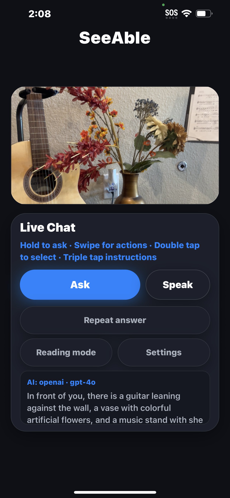
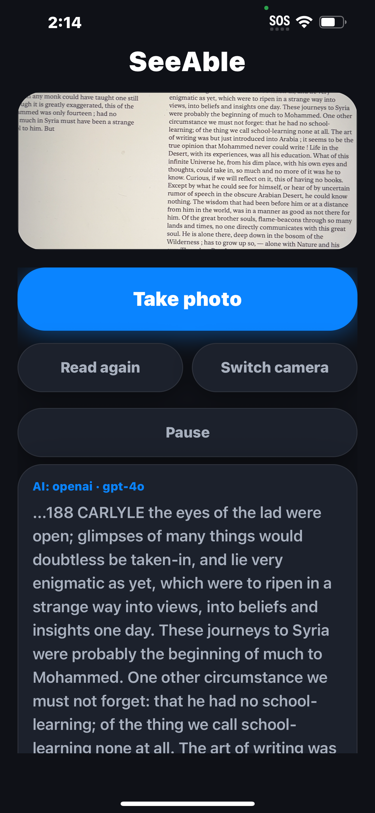
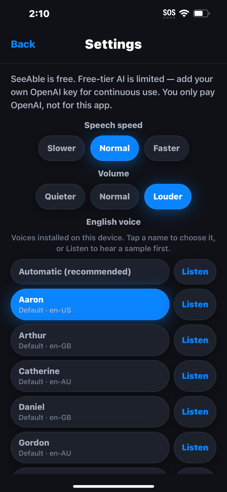

# SeeAble

SeeAble is a mobile app that helps blind and low-vision users understand what is in front of the camera and hear printed text read aloud.

## Overview

Printed text, signs, and nearby objects are hard to interpret without sight. SeeAble is built for people who are blind or have low vision and want spoken information from a phone camera.

The app captures a photo of the current view, sends it to a remote AI service for analysis, and speaks a short answer. Users can ask a question about the scene by voice, or switch to a reading mode that photographs a page, letter, sign, or label and reads the visible text. It is not a navigation or safety tool, and AI answers can be incomplete or wrong.

## Screenshots

Live chat

Reading mode

Settings

## Key Features

- Live questions about the current camera view, with a spoken answer
- Reading mode for printed text (pages, signs, labels)
- Gesture controls designed for use without looking at the screen (hold to speak or capture, swipe to move between actions, double-tap to activate, swipe up or down to pause or resume speech)
- Support for VoiceOver (iOS) and TalkBack (Android), large controls, and spoken status and error messages
- Settings for speech rate, volume, and voice
- No account or sign-in required

## Engineering

SeeAble is a cross-platform mobile application built with Expo, React Native, and TypeScript, with supporting backend services for AI-powered image and speech processing. Spoken responses use on-device text-to-speech.

Accessibility work includes screen-reader labels, focus order, and a custom gesture layer so the main flows can be used without relying on small visual buttons.

This page does not describe APIs, prompts, models, or deployment configuration.

## Project Status

Active project. SeeAble 1.0 is available on the [App Store](https://apps.apple.com/app/id6794635818).

## Source Availability

This repository provides a public overview of SeeAble. The application source code and private configuration are maintained separately.

## About

**Busra Fettahoglu**  
High School Junior

Interests: Electrical & Computer Engineering, Edge AI, Embedded Systems, Accessibility Technology, and Human–AI Interaction
